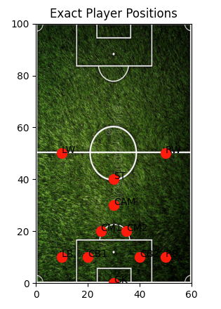
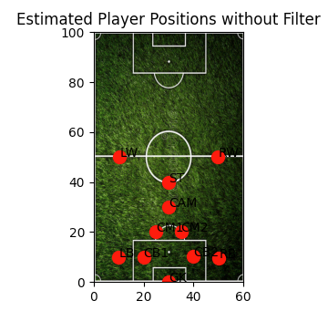
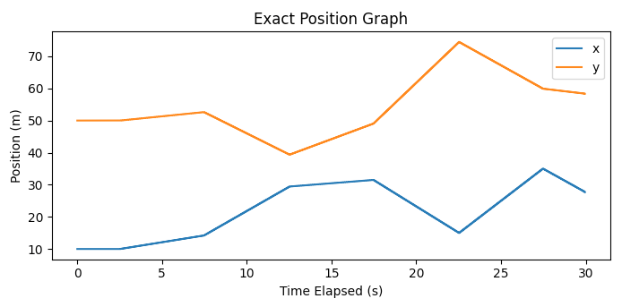
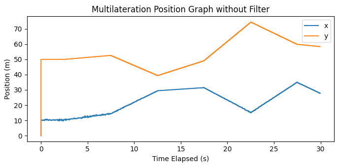
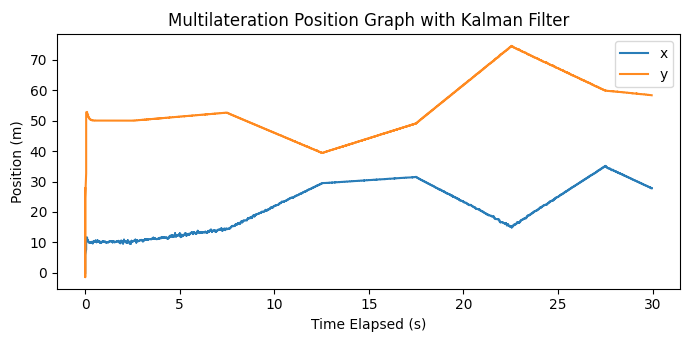

# Multilateration Demonstration

## :book: Introduction
The main objective of this codebase is to demonstrate the use of a multilateration algorithm to track football players on a football pitch.

The list below details the functionalities of the codebase:
1. YAML configuration files that allow for the definition of players, player coordinates, and simulation parameters.
2. config_loader.py file to load the configurations from the YAML files.
3. visuals.py file that allows for the visualization of the players on the pitch along with some necessary position/velocity data.
4. ranging_generator.py file to generate players, move players, calculate player position using multilateration algorithm, and filter noise.
5. launcher.py file to control simulation and demonstrate functionality.

## :gear:‍ Installation
To install, please clone the repo and run:

```sh
cd Multilateration
pip install -r requirements.txt
```

Note that this bot should be used with python 3.7 or 3.8.

## :soccer: To run:
Run the following code in the terminal:
```sh
cd Multilateration
python3 -m launcher.py
```
The script should prompt for two user entries:
1. Football Pitch Animation: Answer with 'True' or 'False' - Will display an animation of the players moving across the football pitch if True (might impact performance).
2. Tracked Player: Answer with one of the following {GK, RB, CB1, CB2, LB, CM1, CM2, CAM, RW, LW, ST} - Prompts for a position to be selected. The position is used to track player movement.

## :information_source: Expected Results
(Please note that these are only examples as player movement is randomized)
1. Animation of exact player positions on pitch.



2. Animation of estimated player positions on pitch calculated using multilateration algorithm.



3. Variation of exact player position over simulation time.



4. Variation of estimated player position over simualtion time (without filter).



5. Variation of estimated player position over simulation time (with Kalman filter applied).



## :file_folder:‍ Overview of Files

`assets` - contains assets for documentation and matplotlib visuals

`config` - contains YAML configuration files used for player positions and simulation parameters

`src` - contains scripts needed to run code
